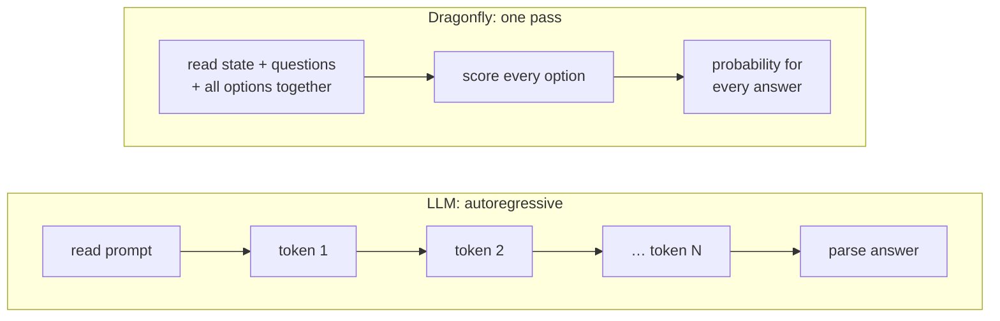
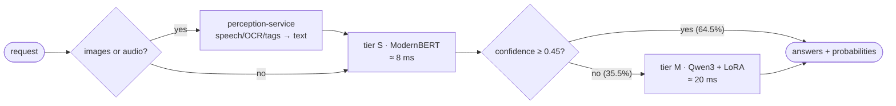

# Dragonfly

**An open-source System One decision model.** You send a document and typed questions; you get back calibrated
probabilities for every possible answer, in **one forward pass**. Dragonfly never generates text, which is why it can
answer in milliseconds where an LLM takes seconds.

Dragonfly is an open alternative to [TypeSafe's Jev](https://typesafe.ai/blog/introducing-system-one-models-and-jev)
and builds on ideas from [Kev](https://github.com/jaredpalmer/kev). It speaks the same `/v1/systemone` API, so existing
TypeSafe and Kev clients work by changing `base_url`.

> **Status: pre-release (v0.1.0.dev).** The platform is built, tested and measured end to end: both model tiers are
> trained, and there are images and audio, plugins, backend, UI, Docker and CI. Checkpoints are not yet published on
> Hugging Face.

## What it does

```jsonc
// POST /v1/systemone
{
  "state": "I ordered a new card two weeks ago and it still hasn't arrived.",
  "questions": {
    "intent":   { "type": "choice", "criteria": { "card_arrival": null, "card_not_working": null, "change_pin": null } },
    "escalate": { "type": "noul",   "instructions": "Escalate to a human now?" },
    "mood":     { "type": "score",  "criteria": ["very negative", "negative", "neutral", "positive", "very positive"] }
  }
}
// -> every question answered in the same pass, each with calibrated probabilities
{
  "answers": {
    "intent":   { "type": "choice", "choice": "card_arrival", "confidence": 0.93, "probabilities": { ... }, "tier": "S" },
    "escalate": { "type": "noul", "noul": 0.21, "confidence": 0.58, "tier": "S" },
    "mood":     { "type": "score", "score": 1.12, "confidence": 0.74, "probabilities": { ... }, "tier": "M" }
  },
  "latency_ms": 4.8
}
```

| Type | Answer |
|---|---|
| `choice` | one of up to 255 named options, with a probability for each |
| `noul` | a calibrated yes/no probability |
| `score` | the expected level on an ordered scale, with a probability per level |

## Results (measured, RTX 3090 Ti)

**Accuracy** on Kev's decision-v2 test split (1,440 questions):

| Model | Accuracy | Calibration error (ECE) | Order-flip rate |
|---|---|---|---|
| Dragonfly-S2 (ModernBERT-base, distilled from M-4B) | 80.1% | 0.063 | 4.5% |
| Dragonfly-M (Qwen3-4B + LoRA) | 86.2% | 0.047 | 0.14% |
| **Cascade S→M** (served, threshold 0.70) | **84.4%** | - | 26.2% of questions go to M |

Both tiers were trained on mix-v1: 32.9k questions from Kev's public suites and typed-decisions' train split,
screened against every test split ([docs/MODEL.md](docs/MODEL.md#data)).

**Versus common LLMs on the same GPU and the same requests** (`bench/compare_llm.py`; measured with the v0.1 models, S + M-1.7B):

| Against | Dragonfly | LLM | Dragonfly is |
|---|---|---|---|
| Qwen2.5-7B, answer only | 79.1% at 18 ms | 74.4% at 103 ms | **5.7× faster**, more accurate |
| Qwen2.5-7B, reasoning | 79.1% at 18 ms | 76.7% at 995 ms | **55× faster**, more accurate |
| Qwen3-8B, thinking | 84.6% at 16 ms | 80.0% at 1,658 ms | **105× faster**, more accurate |

**Images and audio** (`bench/compare_media.py`):

| Task | Dragonfly | Common model | Dragonfly is |
|---|---|---|---|
| Image → decision (OCR + tags + answer) | 71–104 ms | Qwen2.5-VL-7B: 2.2–3.0 s | **22–39× faster**, same answers |
| 10.4 s speech → text | 71 ms | Whisper large-v3-turbo: 551 ms | **7.8× faster**, same words |

**Versus other open decision models, and Jev's published numbers** (same GPU, identical requests;
`bench/compare_systemone.py`):

| typed-decisions (390 requests, 1,950 decisions) | Trained on its train split? | Accuracy | p50 |
|---|---|---|---|
| **Dragonfly** (general, cascade) | yes (in mix-v1) | **79.2%** | 125 ms |
| Laya-typed-decisions | yes | 76.8% | 57 ms |
| Dragonfly-td specialist (tier S) | yes | 72.8% | **51 ms** |
| Jev 1.13.0 *(published)* | no | 72.7% | 710 ms (hosted) |
| Kev-4B | no | 67.0% | 114 ms |
| Kev-0.8B | no | 46.3% | 32 ms |
| Laya (English base) | no | 36.3% | 59 ms |

| decision-v2 (1,166 requests, 1,430 questions) | Accuracy | p50 | p95 | req/s (1 client) |
|---|---|---|---|---|
| Kev-4B | **87.9%** | 43.0 ms | 225 ms | 14.1 |
| Kev-0.8B | 85.0% | 16.7 ms | 163 ms | 25.8 |
| **Dragonfly** (threshold 0.70, default) | 84.6% | 16.5 ms | 73 ms | 36.1 |
| **Dragonfly** (threshold 0.45, fast) | 82.3% | **12.3 ms** | **46 ms** | **48.2** |
| Laya (English base) | 64.4% | 52.2 ms | 72 ms | 12.5 |

**Where Dragonfly stands (all measured on one RTX 3090 Ti, identical requests):**
- **Fastest on decision-v2:** 2.6× faster than Kev-4B at the median, and the best tail (p95) and throughput of all.
  Kev-0.8B matches its median latency.
- **Most accurate on typed-decisions**, ahead of Laya-typed-decisions (+2.4 points) and Jev's published score (+6.5),
  but about 2× slower than Laya there: 71% of those long, multi-question requests go to the 4B tier.
  The tier S specialist answers in 51 ms at 72.8%.
- **Kev-4B is still more accurate on decision-v2** (3.3 points; the gap was 12.1 points before v0.2).

Details and every source: [docs/MODEL.md](docs/MODEL.md#versus-kev-laya-and-jev).

**Honest note on "200×":**
- Measured locally, Dragonfly is 55–105× faster than LLMs that reason, and more accurate.
- 200× is what Jev reports against hosted frontier models (3–329 s per answer, network included). We haven't measured
  a hosted API yet. `bench/compare_llm.py` does it with one API key.

Details: [docs/MODEL.md](docs/MODEL.md) and [docs/PERCEPTION.md](docs/PERCEPTION.md).

## How it works

An LLM **writes** its answer token by token. Dragonfly **scores every possible answer at once**, in one forward pass:



A request goes to the fast model first. Only the questions it is unsure about go to the bigger one:



Tier M answers a whole request in **one packed sequence**. The attention mask lets it read the document once and keeps
questions and options from seeing each other, so reordering the options can't change the answer:


**The full walkthrough with diagrams:** [docs/ALGORITHM.md](docs/ALGORITHM.md). It covers:
- the one-primitive design;
- both model tiers;
- the cascade;
- calibration and distillation;
- image and audio perception;
- CUDA graphs.

## Models

| Tier | Model | Role |
|---|---|---|
| **S** | ModernBERT encoder + pointer head | Speed: answers every question first |
| **M** | Qwen3 + LoRA + pointer head, one packed pass per request | Quality: re-answers only questions S is unsure about |

Dragonfly-M reads the document once and keeps questions and options isolated from each other. Every option also starts
at the same position, so **reordering options cannot change the answer**. This holds by construction and is tested to
within 1e-5; Kev changes its answer under reordering about 7% of the time.

See [docs/ARCHITECTURE.md](docs/ARCHITECTURE.md).

## Why it is fast

1. **One forward pass, no generation:** every option is scored in parallel.
2. **Many questions per request:** they share one pass instead of one LLM call each.
3. **Cascade:** the small tier S answers most questions; only unsure ones pay for tier M.
4. **CUDA graphs** for both tiers: a whole forward pass replays as one GPU launch. Measured 30 → 8.5 ms for tier S
   and 113 → 21 ms for tier M. Common shapes are captured at startup.
5. **Local serving, dynamic batching, answer cache, optional `torch.compile`.**

**Measured** (S2 → M-4B cascade, 3-question request, `bench/latency.py`, unique requests):
- 1 client: 49 ms end to end, 42 ms in the model (2 of the 3 questions go to the 4B tier).
- 32 clients: 31 requests/s (93 questions/s), bounded by the 4B tier. Tier S alone answers in about 5 ms.
- An idle desktop GPU clocks down: the first request after a pause can take 200–350 ms. Servers should lock the GPU
  clocks ([docs/MODEL.md](docs/MODEL.md#speed)).

`bench/compare_llm.py` measures **both** comparisons on the same data against any OpenAI-compatible API, so you can
check these numbers yourself.

## Architecture

```
                      ┌─────────── nginx (TLS) ───────────┐
 clients / SDKs ────► │ /v1/*  → model-service (hot path) │
 browser ───────────► │ /api/* → backend                  │
                      │ /      → ui                       │
                      └───────────────────────────────────┘
 model-service  Python/PyTorch · tiers S+M · batching · cache · plugins · /metrics
 backend        NestJS · Postgres · accounts, API keys, usage, playground
 ui             React · playground, keys, usage, model & plugins
 redis          API keys and usage, shared by backend and model-service
 plugins        Python packages (in-process) or gRPC sidecars (any language)
```

The backend is **never on the inference path**: `/v1` goes straight to the model-service, which checks API keys against
an in-process cache backed by Redis.

## Quick start

With Docker and an NVIDIA GPU:

```bash
cp docker/.env.example docker/.env        # then change the passwords and keys
docker compose -f docker-compose.local.yml --env-file docker/.env up --build
```

- **UI:** open http://localhost:8080 and sign in with `ADMIN_EMAIL` / `ADMIN_PASSWORD`.
- **API:** create a key in the UI, then call the model:

```bash
curl localhost:8080/v1/systemone -H "authorization: Bearer <key>" -H 'content-type: application/json' \
  -d @model-service/examples/request.json
```

No GPU? Set `TORCH_INDEX_URL=https://download.pytorch.org/whl/cpu` and `DRAGONFLY_DEVICE=cpu` in `docker/.env`.

### Train

Training uses Kev's decision-v2 suite: 10 public datasets, the same data Kev reports on.

```bash
python scripts/fetch_data.py
docker compose -f docker-compose.local.yml --env-file docker/.env --profile train   run --rm trainer     # tier S
docker compose -f docker-compose.local.yml --env-file docker/.env --profile train-m run --rm trainer-m   # tier M
```

Then set `DRAGONFLY_CHECKPOINT=/runs/dragonfly-s` (and `DRAGONFLY_CHECKPOINT_M=/runs/dragonfly-m` to turn on the
cascade) and restart. Each run writes `metrics.json`: accuracy, ECE, Brier, the share automatable at 5% error, and the
option-order flip rate. `scripts/publish_hf.py` turns those measurements into a Hugging Face model card.

### Benchmark

```bash
python bench/latency.py --url http://localhost:8000 --concurrency 32            # p50/p95 and throughput
LLM_BASE_URL=... LLM_API_KEY=... LLM_MODEL=... \
  python bench/compare_llm.py --data data/decision-v2/test.jsonl --n 50        # vs an LLM, fair and unfair modes
```

## Images and audio

Put `{"type": "image" | "audio", "data": "<base64>"}` anywhere in the `state`. The **perception-service** turns it
into text with **non-autoregressive** models before the decision:
- **speech:** CTC speech recognition (English Parakeet, Persian wav2vec2);
- **text in images:** PP-OCR;
- **what an image shows:** SigLIP-2 tags.

`POST /v1/perceive` converts without deciding. In the UI, the **Media** page does the same, and the Playground has an
attach button. See [docs/PERCEPTION.md](docs/PERCEPTION.md).

## Plugins

The core is Apache-2.0. Plugins are separate, so they can be **open or closed source**.

**Two kinds:**
- **Python packages**, loaded in-process through an entry point, with microsecond overhead.
- **gRPC sidecars** in any language, with their own container, a time budget, and a fail-open or fail-closed policy.

**Hooks:**
- `on_request`: before the model;
- `on_decision`: after the model;
- `on_low_confidence`: for unsure answers, e.g. escalation to an LLM or a human.

See [docs/PLUGINS.md](docs/PLUGINS.md), [plugins/example-python](plugins/example-python) and
[plugins/example-grpc](plugins/example-grpc).

## Repository

| Path | Contents |
|---|---|
| `model-service/` | Python package `dragonfly`: models, engine, API, plugins, training, tests |
| `perception-service/` | Python package `perception`: images and audio to text (CTC ASR, PP-OCR, SigLIP-2) |
| `backend/` | NestJS API: auth, keys, usage, model proxy |
| `ui/` | React dashboard |
| `proto/` | gRPC plugin protocol |
| `plugins/` | example plugins (Python and gRPC) |
| `bench/`, `scripts/` | benchmarks, data download, Hugging Face publishing |
| `nginx/`, `ops/`, `docker/` | edge proxy, deploy/TLS/monitoring, environment template |
| `docs/` | architecture, plugins, deployment |

## Documentation

| Doc | Covers |
|---|---|
| [docs/ALGORITHM.md](docs/ALGORITHM.md) | **how it works, visually**: diagrams of every step |
| [docs/ARCHITECTURE.md](docs/ARCHITECTURE.md) | services, hot path, model design, cascade, calibration |
| [docs/MODEL.md](docs/MODEL.md) | tiers, data, training and evaluation, metrics, results, speed |
| [docs/API.md](docs/API.md) | `/v1` and `/api` endpoints, request and response shapes, errors |
| [docs/PERCEPTION.md](docs/PERCEPTION.md) | images and audio: models, API, limits, measured speed |
| [docs/PLUGINS.md](docs/PLUGINS.md) | in-process and gRPC plugins, closed-source delivery |
| [docs/SWARM.md](docs/SWARM.md) | the swarm: specialist models behind one endpoint, `"model": "auto"` routing |
| [docs/LOCAL_DEVELOPMENT.md](docs/LOCAL_DEVELOPMENT.md) | running locally, tests, Windows gotchas |
| [docs/DEPLOYMENT.md](docs/DEPLOYMENT.md) | production, TLS, deploys with rollback, monitoring |
| [CLAUDE.md](CLAUDE.md) | project summary and working rules for AI assistants and contributors |

## Roadmap

- [x] **M0** repository, Docker, CI
- [x] **M1** model-service: `/v1/systemone`, Dragonfly-S, batching, calibration, training and evaluation
- [x] **M2** Dragonfly-M: Qwen3 + LoRA, packed pass, order-invariant options
- [x] **M3** cascade S→M, answer cache, `torch.compile`, benchmarks vs LLMs
- [x] **M4** backend (NestJS) and UI (React), API keys and usage through Redis
- [x] **M5** gRPC sidecar plugins in any language
- [x] Tier M trained, cascade tuned, M→S distillation, tier M state cache, CUDA graphs for both tiers, LoRA merge
- [x] Images and audio: perception-service (CTC speech, PP-OCR, SigLIP-2 tags), Media page
- [x] Benchmarks against local LLMs (text, image, audio)
- [ ] **v0.1 release:** checkpoints on Hugging Face (`scripts/publish_hf.py`), public GHCR packages, `v0.1.0` tag
- [ ] Benchmark against a hosted frontier API; TensorRT FP8 for tier S; a larger tier M (Qwen3-4B); more languages

## License

[Apache-2.0](LICENSE). Training data from Kev's suites keeps each source dataset's own license.
