# How Dragonfly works

This page explains the algorithm with pictures. The code lives in `model-service/src/dragonfly/` and
`perception-service/src/perception/`.

## 1. The core idea: answer every question in one pass

An LLM answers by **writing**: it produces one token, feeds it back in, produces the next, and repeats. Often it writes
reasoning first. Dragonfly never writes. The question's possible answers are already known (the `criteria`), so it
**scores all of them at once** in a single forward pass and returns a probability for each.

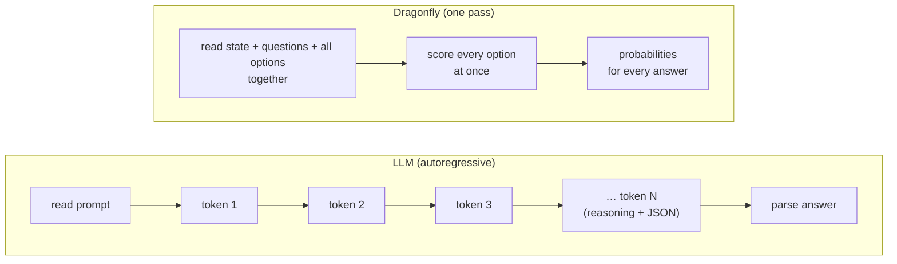

**Measured cost of that difference** (same GPU): a thinking LLM took 1,658 ms per request and Dragonfly took 16 ms.

## 2. What happens to one request

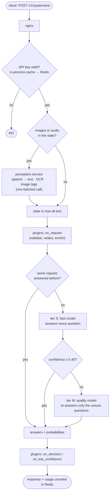

**Sizes and costs:**
- The backend (accounts, keys, usage) is **never in this path**, so it adds no latency.
- Typical cost on an RTX 3090 Ti: tier S about 8 ms, tier M about 20 ms, perception 10–80 ms per image or clip.

## 3. One primitive for every question type

Every question becomes "pick among options", so one model head serves all three types:

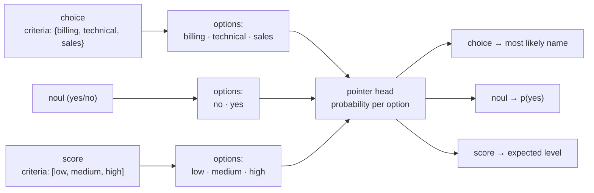

## 4. Tier S: the fast model (ModernBERT encoder)

Each question becomes one row that the encoder reads in both directions. The options come **before** the document, so
cutting a long document can never cut an option.

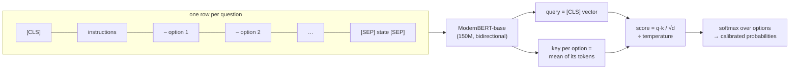

All questions of a request, and all requests in a batch, run as rows of **one** forward pass.

## 5. Tier M: the quality model (Qwen3 + LoRA)

A whole request is **one packed sequence**. A custom attention mask controls who can see whom:

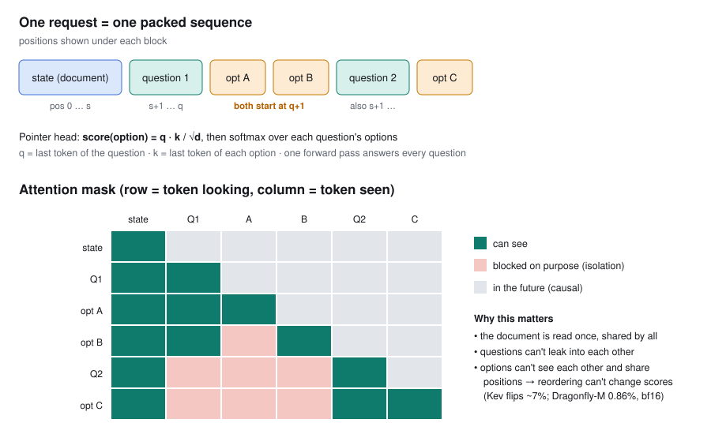

**What the mask guarantees:**
- **The document is read once.** Every question and option sees it; nothing is repeated per question.
- **Questions are isolated.** Question 2 can't see question 1 or its options, so answers can't leak between them.
- **Options are isolated and share positions.** Every option of a question starts at the same position ID and can't
  see its siblings. The model therefore sees each option as if it were the only one, so **reordering options cannot
  change the scores**. The fp32 test is exact; in bf16, 0.86% of answers flip on near-ties.

The pointer head compares the question's last token (query) with each option's last token (key).

## 6. The cascade: fast first, careful only when needed

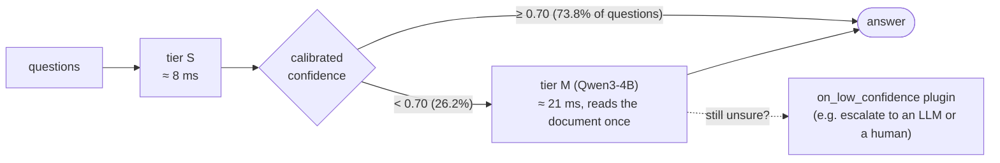

**The threshold (0.70)** is chosen on held-out calibration data (`scripts/tune_cascade.py`), not on the test set.

**Result on 1,440 test questions:**
- tier S2 alone: 80.1%;
- tier M-4B alone: 86.2%;
- **cascade: 84.4%**, with 73.8% of questions never touching tier M.

## 7. Calibration: "70% sure" should mean right 70% of the time

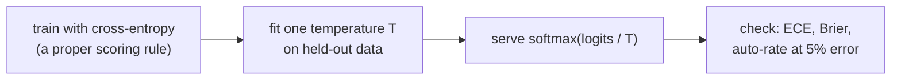

Calibration is what makes the cascade and `on_low_confidence` work: confidence decides when to ask the bigger model.
Measured calibration error: tier S 0.032, tier M 0.027.

## 8. Distillation: the big model teaches the small one

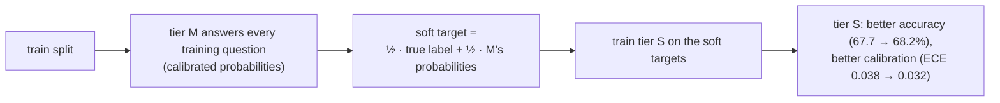

## 9. Images and audio: turned into text, still in one pass

Only **non-autoregressive** models are used, meaning none of them generate text token by token:

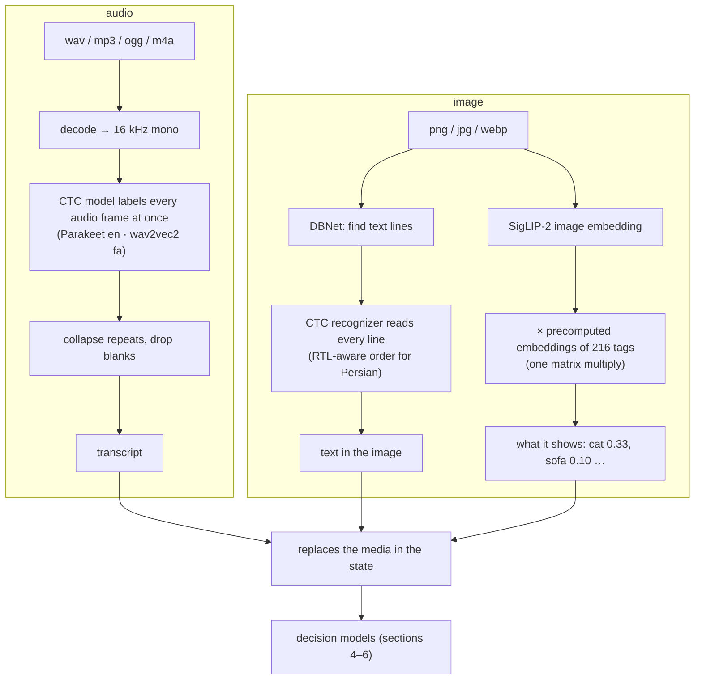

**Measured on an RTX 3090 Ti:**
- 10.4 s of speech becomes the exact transcript in 79 ms; Whisper, which generates text, needed 551 ms.
- A decision about an invoice image takes 103 ms; a 7B vision LLM needed 2.2 s.

## 10. Why the GPU part is fast: CUDA graphs

A forward pass is thousands of tiny GPU operations, and launching each one from Python costs more than running it.

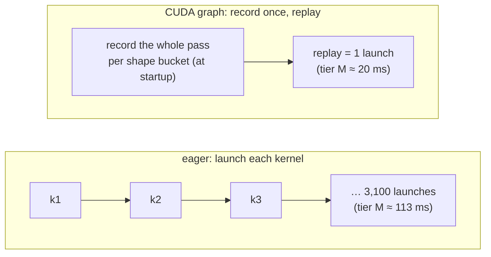

**How it's done:**
- Inputs are padded to shape buckets, and padding is masked out, so answers are unchanged (tested).
- Common buckets are recorded at startup, so no request pays the recording cost.
- Tier M's LoRA adapters are merged into its weights when serving, which removes about 200 extra small multiplies per
  pass.

## 11. Layers of each model

Every model Dragonfly runs, drawn from its real `config.json` (regenerate with `python scripts/draw_layers.py`).

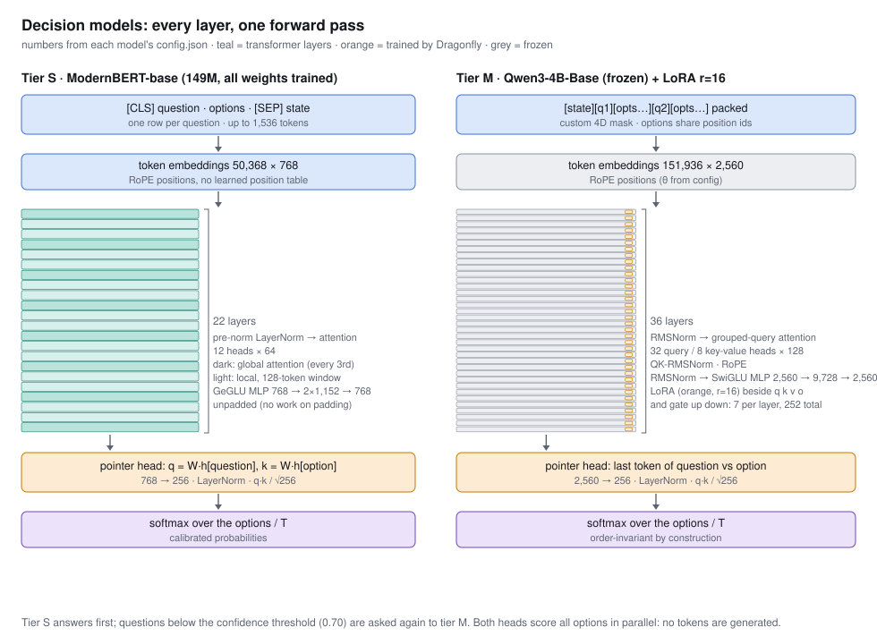

| | Tier S: ModernBERT-base | Tier S-large: ModernBERT-large (candidate) | Tier M: Qwen3-4B-Base |
|---|---|---|---|
| Layers | 22 | 28 | 36 |
| Width | 768 | 1,024 | 2,560 |
| Attention | 12 heads; global every 3rd layer, 128-token local window otherwise | 16 heads; same pattern | 32 query / 8 key-value heads (GQA), head size 128, QK-RMSNorm |
| MLP | GeGLU 768 → 2×1,152 | GeGLU 1,024 → 2×2,624 | SwiGLU 2,560 → 9,728 |
| Positions | RoPE, up to 8,192 | RoPE, up to 8,192 | RoPE, up to 32,768 |
| Trained by Dragonfly | everything (149M) | everything (395M) | LoRA r=16 on 7 projections × 36 layers + head (~34M); the 4B base stays frozen |
| Output | pointer head 768 → 256 | pointer head 1,024 → 256 | pointer head 2,560 → 256 |

Inside one layer of each tier:

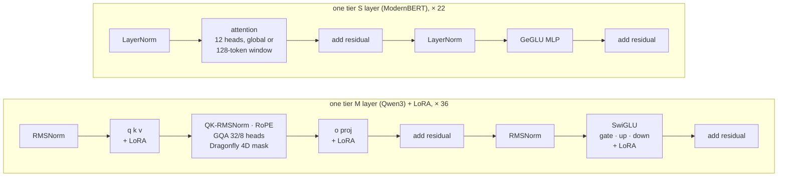

LoRA adds `B·A·x` (rank 16) beside each frozen projection. For serving, the adapters are folded into the weights
(`merge_lora`), unless tier M specialists are installed and need to switch adapters (docs/SWARM.md).

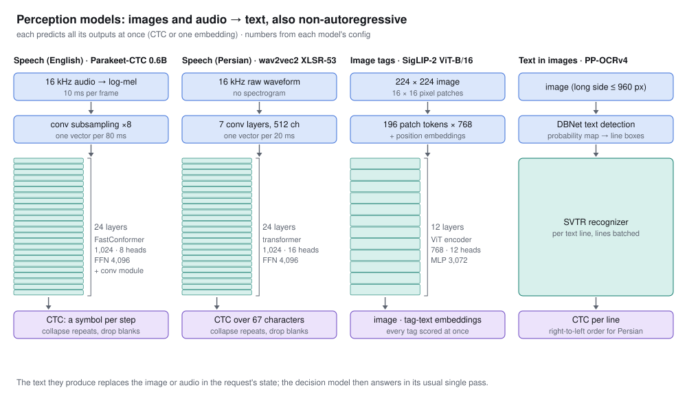

## 12. The learning loop

Dragonfly keeps learning from its own traffic, without anyone writing code:

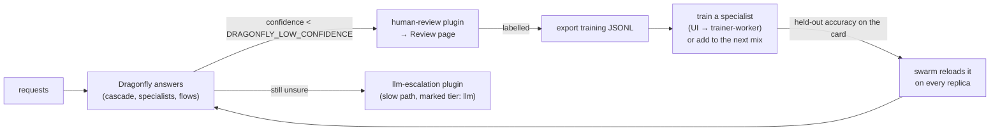

