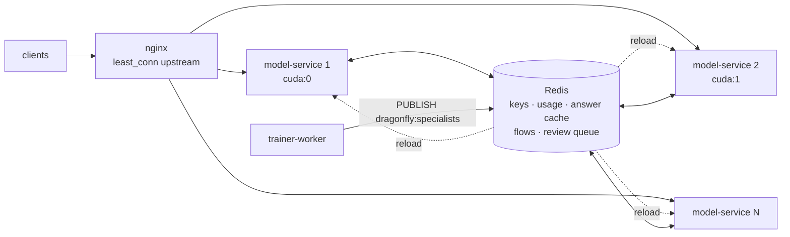

# Deployment

Production runs `docker-compose.prod.yml` on one Linux host with an NVIDIA GPU. It uses prebuilt images from GHCR and
never compiles on the server. nginx is the only public entry point.

## 1. Server setup (once)

```bash
# Docker + NVIDIA container toolkit: https://docs.nvidia.com/datacenter/cloud-native/container-toolkit/
git clone https://github.com/<owner>/dragonfly /opt/dragonfly && cd /opt/dragonfly
cp docker/.env.example docker/.env
```

Then edit `docker/.env`:
- **Secrets:** set `POSTGRES_PASSWORD`, `JWT_SECRET` (`openssl rand -base64 48`), `ADMIN_EMAIL` and `ADMIN_PASSWORD`.
- **Internal key:** set `MODEL_SERVICE_API_KEY` and list the same value in `DRAGONFLY_API_KEYS`.
- **Domain:** set `APP_DOMAIN`.
- **Checkpoints:** copy trained checkpoints into `./runs` and point `DRAGONFLY_CHECKPOINT` (and optionally
  `DRAGONFLY_CHECKPOINT_M`) at them.

## 2. TLS certificate (once)

```bash
APP_DOMAIN=decide.example.com LETSENCRYPT_EMAIL=you@example.com ops/init-letsencrypt.sh
```

The `certbot` container renews the certificate every 12 hours, and nginx reloads every 6 hours to pick it up.

## 3. Start

```bash
export MODEL_IMAGE=ghcr.io/<owner>/dragonfly-model-service:<sha>
export BACKEND_IMAGE=ghcr.io/<owner>/dragonfly-backend:<sha>
export UI_IMAGE=ghcr.io/<owner>/dragonfly-ui:<sha>
docker compose -f docker-compose.prod.yml --env-file docker/.env up -d
```

## 4. Updates

Deploy one service at a time, by commit SHA:

```bash
ops/deploy.sh backend ghcr.io/<owner>/dragonfly-backend:<40-char sha>
```

`deploy.sh` does the following:
- accepts only full-SHA tags;
- backs up Postgres before a backend deploy (the backend runs its migrations at startup);
- waits for the health check and smoke-tests the service;
- **rolls back automatically** to the previous image if any step fails.

## Scale-out (more dragonflies)

The model-service keeps no request state of its own, so you can run several replicas behind the same nginx:



```bash
docker compose -f docker-compose.prod.yml --env-file docker/.env up -d --scale model-service=2
```

- **Balancing.** nginx sends `/v1` to the `model_service` upstream: every replica, re-resolved through Docker DNS as
  replicas come and go, with `least_conn` (a tier M request takes several times longer than a tier S one, so plain
  round-robin would pile work onto one replica).
- **Shared state lives in Redis:** API keys and usage, the answer cache (`DRAGONFLY_CACHE=redis`), specialist
  reloads (pub/sub `dragonfly:specialists`), saved flows and the review queue. A request can land on any replica.
- **GPUs.** Replicas on one GPU share its compute; that only helps while a single replica leaves the GPU idle (small
  batches, CPU-bound tokenization). With several GPUs, give each replica its own with `DRAGONFLY_DEVICE=cuda:K` (or
  `NVIDIA_VISIBLE_DEVICES`) in a per-replica service or override file.
- Replicas are named `dragonfly-model-service-1`, `-2`, …; use `docker compose logs model-service` to see them all.
  The local compose file keeps one named replica with its port published for development.

## Monitoring

```bash
docker compose -f docker-compose.prod.yml --env-file docker/.env --profile monitoring up -d
ssh -L 3001:127.0.0.1:3001 <server>     # Grafana on http://localhost:3001; add Prometheus at http://prometheus:9090
```

**Metrics:** the model-service exports Prometheus metrics at `/metrics`, on the internal network only:
- `dragonfly_request_seconds` and `dragonfly_model_seconds`: latency histograms;
- `dragonfly_questions_total{type,tier}`;
- `dragonfly_cache_total{result}`;
- `dragonfly_requests_total{status}`.

## Security checklist

- `DRAGONFLY_API_KEYS` is never empty in production. The service logs a warning if `/v1` is open.
- Only nginx publishes ports. Grafana binds to 127.0.0.1 and you reach it over an SSH tunnel.
- `docker/.env` is never committed.
- Plugins run with the model-service's permissions (in-process) or on the internal network (gRPC). Deploy only plugins
  you trust.
