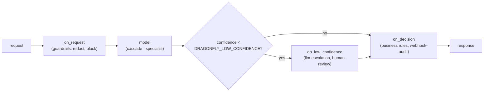

# Plugins

Plugins extend Dragonfly without changing the core, and they can be **closed source**. The core is Apache-2.0, and a
plugin is a separate package that depends only on the stable API in `dragonfly.plugins`.

## Hooks



Hooks run in the order plugins are listed in `DRAGONFLY_PLUGINS`. Blocking plugins run off the event loop (below).


| Hook | When it runs | Typical use |
|---|---|---|
| `setup(ctx)` | once at startup | read settings from `ctx.config` |
| `on_request(request)` | before the model | validate, redact PII, enrich the state, add questions |
| `on_low_confidence(request, qid, answer)` | for each answer below `DRAGONFLY_LOW_CONFIDENCE` | escalate to an LLM or a human queue; return a replacement or `None` |
| `on_decision(request, response)` | after the model | business rules, overrides, audit logging |
| `shutdown()` | once at shutdown | flush buffers, close connections |

Hooks run on the request path, so keep them fast.

**Error handling:**
- Raise `PluginError(message, status)` to reject a request with that HTTP status.
- Any other exception fails the request with 500. If you set `fail_open = True`, the plugin is logged and skipped for
  that request instead.

## Free plugins

Four practical plugins ship with the model-service (`dragonfly.essentials`, Apache-2.0). Enable them by name in
`DRAGONFLY_PLUGINS` and configure them with `DRAGONFLY_PLUGIN_<NAME>_<KEY>` (see `docker/.env.example`).

| Plugin | Hook | What it does | Settings (`<KEY>`) |
|---|---|---|---|
| `guardrails` | `on_request` | Redacts e-mails, IBANs, card and phone numbers; flags or blocks prompt injection and profanity; rejects oversized states (413). Adds a `guardrails` field to the response. | `PII` (redact/off), `INJECTION` and `PROFANITY` (flag/block/off), `MAX_STATE_CHARS`, `PROFANITY_WORDS` |
| `human-review` | `on_low_confidence` | Queues unsure answers in Redis for the UI **Review** page. The answer itself is not changed. Reviewed items export as training JSONL, which closes the learning loop. | `REDIS_URL`, `SAMPLE`, `MAX_PENDING` |
| `webhook-audit` | `on_decision` | Sends decisions to a webhook URL, a Slack incoming webhook and/or a JSONL file, from a background queue with retries. `WHEN` filters, e.g. `urgent.noul>0.8 or intent.choice==refund`. | `URL`, `SLACK_URL`, `FILE`, `WHEN`, `INCLUDE_STATE`, `RETRIES` |
| `llm-escalation` | `on_low_confidence` | Asks any OpenAI-compatible LLM (default: the local Ollama from `--profile llm`) to pick one of the options. The replacement answer is marked `tier: "llm"`, `calibrated: false` and keeps Dragonfly's answer in `escalated_from`. If the LLM is down or slow, Dragonfly's answer stays. | `BASE_URL`, `MODEL`, `API_KEY`, `TIMEOUT_S` |

`llm-escalation` and `human-review` act on answers below `DRAGONFLY_LOW_CONFIDENCE`, so set it (e.g. `0.5`).
Escalated answers are as slow as the LLM: only the unsure fraction pays that cost.

### Blocking plugins

A plugin that does network or disk I/O sets `blocking = True` (API 1.1). Its hooks then run in a thread pool with a
`timeout_s` budget, so they never stall other requests on the event loop. On timeout a `fail_open` plugin is skipped;
otherwise the request fails. gRPC plugins are always blocking.

## Writing one

```python
from dragonfly.plugins import Plugin, PluginError

class BlockRefunds(Plugin):
    name = "block-refunds"
    version = "1.0.0"
    api_version = "1.0"

    def on_request(self, request):
        if "refund" in str(request.state).lower():
            raise PluginError("refunds are handled by a human", 403)
        return request
```

Register it in your package's `pyproject.toml`:

```toml
[project.entry-points."dragonfly.plugins"]
block-refunds = "my_package:BlockRefunds"
```

Then enable it with `DRAGONFLY_PLUGINS=block-refunds`.

**Behaviour:**
- Nothing loads unless it is listed.
- An enabled plugin that isn't installed stops startup, so a missing policy plugin can never be skipped silently.
- Plugins run in the order they are listed.

**Settings:** `DRAGONFLY_PLUGIN_<NAME>_<KEY>=value` arrives as `ctx.config["<key>"]`. For example,
`DRAGONFLY_PLUGIN_BLOCK_REFUNDS_STATUS=451` becomes `ctx.config["status"]`.

## Shipping a closed-source plugin

Build a wheel, publish it to a private package index, and install it into an image derived from the public one:

```dockerfile
FROM ghcr.io/<owner>/dragonfly-model-service:<version>
USER root
RUN --mount=type=secret,id=pip_index_url \
    pip install --index-url "$(cat /run/secrets/pip_index_url)" my-closed-plugin==1.2.0
USER dragonfly
ENV DRAGONFLY_PLUGINS=my-closed-plugin
```

The public repository never contains the plugin's code. Apache-2.0 allows this.

## Versioning

`API_VERSION` follows semver. A plugin loads when the major versions match and its minor version is not newer than the
host's. Breaking changes bump the major version and are announced in the changelog.

## Out-of-process plugins (gRPC, any language)

A plugin can also be its own container, written in any language, that implements
[`proto/dragonfly/plugin/v1/plugin.proto`](../proto/dragonfly/plugin/v1/plugin.proto). The hooks are the same.

**How it works:**
- Payloads are JSON strings in the same shapes as the HTTP API, so you don't need any Dragonfly types.
- `Describe` tells the host which hooks to call.
- A reply with `reject_status > 0` rejects the request with that HTTP status.

**Generate stubs in your language:**

```bash
protoc -I proto --go_out=. --go-grpc_out=. dragonfly/plugin/v1/plugin.proto   # Go; similar for Java, C#, Rust, Node...
```

**Enable it:**

```bash
DRAGONFLY_GRPC_PLUGINS=policy@plugin-policy:50051      # name@host:port, comma separated, run in this order
DRAGONFLY_PLUGIN_POLICY_TIMEOUT_MS=20                  # time budget per call (default 50)
DRAGONFLY_PLUGIN_POLICY_FAIL_OPEN=1                    # on timeout or error: skip it (default: fail the request)
```

**Startup:**
- The host waits up to about 30 s for a sidecar to come up.
- If the sidecar is still unreachable, startup fails. A policy plugin must never be skipped silently.

**Example:** [`plugins/example-grpc`](../plugins/example-grpc) is a policy sidecar built from `protoc` stubs. It rejects
oversized states and flags low-confidence responses for review. Run it with:

```bash
docker compose -f docker-compose.local.yml --env-file docker/.env --profile plugins up
```

### Which kind to choose

| | In-process (Python package) | Sidecar (gRPC) |
|---|---|---|
| Language | Python | any |
| Overhead per hook | microseconds | about 0.2–1 ms (local network) |
| Isolation | shares the model-service process | own container, own dependencies, own crash domain |
| Closed source | private wheel in a derived image | private image, nothing to install into Dragonfly |
