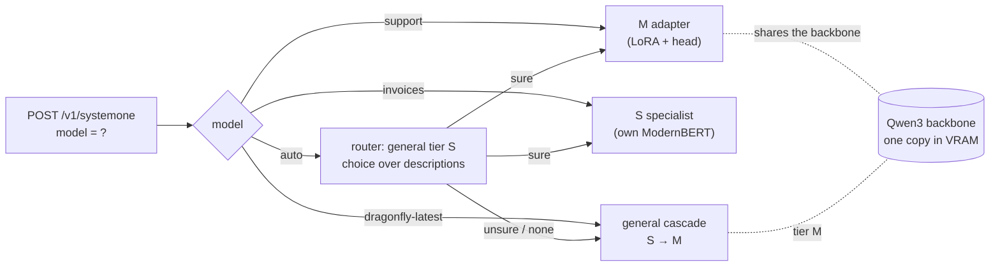
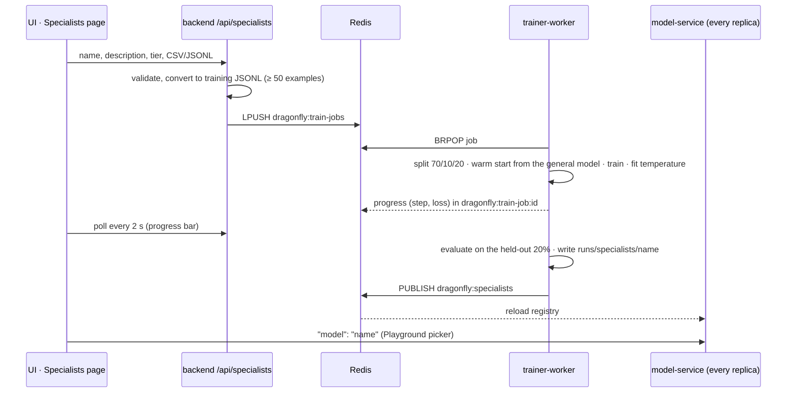
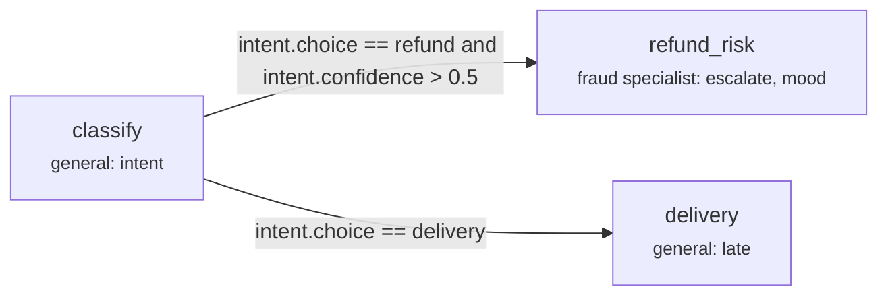

# The swarm: specialist dragonflies

One Dragonfly server can host many **specialists**. A specialist is a small model trained for one job (your invoices,
your support tickets, your moderation policy). They share the GPU and the endpoint. A request picks one with the
existing `model` field, so every TypeSafe/Kev client can use them without changes.



## Two kinds of specialist

| | Tier S specialist | Tier M adapter |
|---|---|---|
| What it is | a full Dragonfly-S checkpoint | LoRA adapters + pointer head for the general tier M |
| Disk | ~0.6 GB | ~140 MB (Qwen3-4B, r=16) |
| VRAM | ~0.3 GB each, loaded on first use, least recently used unloaded beyond `DRAGONFLY_SWARM_MAX_LOADED` | none extra: all adapters share the one backbone |
| Speed | tier S speed (a few ms) | tier M speed + 2.4 ms per adapter switch (measured, below) |
| Train | minutes | longer; needs the GPU (see [TRAINING](TRAINING.md)) |

**How adapters switch without reloading.** With tier M adapters present, the general M is served unmerged (LoRA
beside the frozen weights instead of folded in). Switching copies the specialist's adapter and head weights **into the
same tensors** (`copy_`). CUDA graphs replay whatever those tensors hold, so the graphs captured at startup stay valid
for every specialist. Each adapter keeps its own document KV cache, because cached keys and values depend on the
adapter. Requests are grouped by specialist inside each batch, so a mixed batch costs one switch per specialist.

**Measured** on an RTX 3090 Ti with Qwen3-4B (a 3-question request, median of 50, CUDA graphs on):

| | Latency |
|---|---|
| tier M request, adapters merged (no swarm, the default) | 21.0 ms |
| tier M request, adapters unmerged (swarm with tier M specialists) | 26.4 ms |
| switching adapters (504 LoRA tensors + head, one fused copy) | 2.4 ms |
| switch + request | 27.7 ms |

Switching back to the general adapter restores the same answers as before the switch (tested to 1e-5), and no CUDA graph had to be
recaptured (0 fallbacks). The cost of the swarm is the unmerged LoRA (+5.4 ms per tier M request), paid only when at
least one tier M specialist is installed; tier S specialists never change the general model's path.

## Adding one

A specialist is a folder in `DRAGONFLY_SPECIALISTS` (default `/runs/specialists`, which is `./runs/specialists` on
the host):

```
runs/specialists/invoices/
  specialist.json      {"name": "invoices", "description": "invoices and payment documents", "metrics": {...}}
  config.json          written by dragonfly-train (tier, backbone, temperature, ...)
  head.pt, backbone/ | lora.pt, tokenizer/
```

- Train it with `dragonfly-train` on your data (tier S, or tier M with `--backbone` matching the served M), then write
  `specialist.json`. The UI **Specialists** page does all of this for you (upload, train, register).
- A tier M adapter must match the served M: the same backbone, LoRA rank, head size and head norm. Otherwise it is
  skipped with a log line explaining the mismatch.
- The `description` matters: `"model": "auto"` routes by it.
- Reserved names: `auto`, `general`, `dragonfly-latest`, `jev-latest`, `kev-latest`.

**Loading.** A new or retrained tier S specialist is read from disk and copied to the GPU on a background thread as
soon as the reload notice arrives, so its first request doesn't wait for either (measured: 8.4 s → 0.21 s for the first
request after training; the rest is capturing that request's CUDA graph once). The copy never overlaps a CUDA-graph
capture on the model thread (`models.graphs.CAPTURE_LOCK`).

**Reloading.** The server rescans the folder when anything is published on the Redis channel `dragonfly:specialists`
(`redis-cli PUBLISH dragonfly:specialists reload`). The backend does this after training. Every replica listens, so
all of them pick up the change. A tier S specialist that was replaced on disk is reloaded on its next request.

## Train your own (UI → specialist in minutes)



- **Upload.** Either a CSV with the columns `text,label` plus one question (yes/no, choice or score, with its
  options), or JSONL in the training format (full requests with a `label` per question, see
  `model-service/src/dragonfly/data.py`). The backend rejects bad rows with their line numbers, and needs at least
  50 examples.
- **Training** runs in the `trainer-worker` service. It starts from the general model of that tier
  (`DRAGONFLY_INIT_S`, default `DRAGONFLY_CHECKPOINT`), so a specialist keeps everything the general model knows and
  only learns your job. It uses 70% of the data to train, 10% to fit the temperature (calibrated confidences), and
  holds out 20% that it never trains on. The accuracy on that 20% is what the card shows.
- **GPU sharing.** A tier S job is small (ModernBERT-base, 512 tokens per row by default) and trains beside serving.
  A tier M job trains LoRA adapters on the 4B backbone and needs most of a 24 GB GPU. It is refused unless
  `DRAGONFLY_TRAIN_M=1`: use a second GPU, or stop tier M serving while it trains.
- **Human review** closes the loop: label unsure production decisions on the Review page, export them as JSONL and
  train (or retrain) a specialist on them. Retraining a name replaces the old version atomically.

## Using one

```bash
curl -s localhost:8000/v1/specialists
curl -s localhost:8000/v1/systemone -H 'content-type: application/json' -d '{
  "model": "typed-decisions",
  "state": "Hi, my parcel never arrived and I was charged twice.",
  "questions": {"escalate": {"type": "noul", "instructions": "Does this need a human agent?"}}}'
```

The response adds `"specialist": "<name>"` (or `"general"`), so with `"model": "auto"` you can see where it went.
An unknown model name is a 422 when the swarm is enabled.

**Auto routing.** The general tier S answers one `choice` question: *which specialist should handle this document?*
Its options are the specialists' descriptions plus "none of these". That is one extra fast forward pass. Below
`DRAGONFLY_ROUTE_THRESHOLD` confidence, or on "none", the general model answers. Routing is only as good as the
descriptions and the general model, so name the domain concretely ("Dutch invoices and payment reminders", not
"finance").

## Agent flows: chains of dragonflies

A flow is a small graph of steps. Each step asks one model (the general model, a specialist, or `auto`) a few
questions; each edge has a condition on those answers and picks the next step. The model-service runs the whole
chain itself: no network hop between steps, one batched decision per step.



```json
{
  "start": "classify",
  "steps": {
    "classify": {
      "questions": {"intent": {"type": "choice", "criteria": {"refund": "wants money back", "delivery": null, "other": null}}},
      "next": [{"if": "intent.choice == refund and intent.confidence > 0.5", "to": "refund_risk"},
               {"if": "intent.choice == delivery", "to": "delivery"}]
    },
    "refund_risk": {
      "model": "fraud",
      "state": "{{state}}

The customer asks for a refund.",
      "questions": {"escalate": {"type": "noul", "instructions": "Should a human approve this refund?"}}
    },
    "delivery": {"questions": {"late": {"type": "noul", "instructions": "Is the parcel late?"}}}
  }
}
```

- **Conditions:** `<question>.<field> <op> <value>` clauses joined with `and`, alternatives with `or` (`and` binds
  tighter). Fields: `choice`, `noul`, `score`, `confidence`, or `value` (whichever answer the question has). Operators:
  `== != > >= < <=`. The first edge that holds wins; an edge without `if` always holds; no match ends the flow.
- **State mapping:** a step's `state` is a template. `{{state}}` is the flow's input, and
  `` is an earlier answer. Without `state`, a step sees the flow's input.
- **Safety:** flows are validated before they run (every edge must reach a defined step), and a run stops after 16
  steps, so a loop can't spin forever.
- **Run:** `POST /v1/flows/run {"flow": {...}, "state": ...}` for an inline flow, or save it from the UI **Flows** page
  (stored in Redis) and call `POST /v1/flows/<name>/run {"state": ...}`. Add `"mermaid": true` to get the diagram
  with the path taken highlighted. The response has the path, every step's answers, and per-step latency.
- Each step goes through the same pipeline as `/v1/systemone`: plugins, cache, usage accounting.
