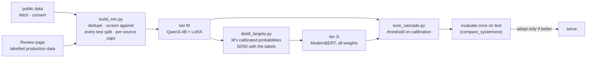

# Training Dragonfly

How the served models were trained, and how to train them again with more data. For specialists trained from the UI,
see [SWARM](SWARM.md#train-your-own-ui--specialist-in-minutes). For the metrics and results, see [MODEL](MODEL.md).

## The recipe

Every step is one command of `scripts/train_recipe.sh`. The GPU steps run in the Docker `trainer` service, so they
survive terminal restarts. Stop serving first (`docker stop dragonfly-model-service dragonfly-perception
dragonfly-trainer-worker`); training needs the GPU.

| Step | Command | Time (RTX 3090 Ti) | Output |
|---|---|---|---|
| 1. Data | `scripts/train_recipe.sh data` | minutes (downloads) | `data/mix-v2/{train,calibration}.jsonl`, `report.json` |
| 2. Tier M | `scripts/train_recipe.sh m` | ~2.4 h per epoch of mix-v1; ~3.5 h per epoch of mix-v2 | `runs/dragonfly-m4b-v2` |
| 3. Soft targets | `scripts/train_recipe.sh distill` | ~20 min | `data/mix-v2/train.distilled.jsonl` |
| 4. Tier S | `scripts/train_recipe.sh s` | ~35 min (base) / ~1.5 h (large) | `runs/dragonfly-s3` |
| 5. Cascade | `scripts/train_recipe.sh cascade` | ~10 min | the threshold, and one test measurement |
| 6. Evaluate | serve the new checkpoints, then `scripts/train_recipe.sh eval` | ~10 min | `runs/recipe-*.json` |

Settings are environment variables: `MIX`, `M_INIT`, `M_OUT`, `S_BACKBONE`, `S_OUT`, `EPOCHS_M`, `EPOCHS_S` (see
the script's header).

## Data

| Mix | Questions | Sources |
|---|---|---|
| mix-v1 | 32,931 | decision-v2, Kev decision-v8, public-pool-v6, devtools-v1, longstate-v2, typed-decisions train |
| mix-v2 | 47,420 | mix-v1 + CLINC150 (CC-BY-3.0), HellaSwag (MIT), SNLI (CC-BY-SA-4.0), Civil Comments (CC0), GoEmotions (Apache-2.0), 2,900 each |

- **No test leakage:** `build_mix.py` drops every training record whose document appears in the decision-v2 test or
  calibration split or the typed-decisions test split (by normalised text and by Kev's text hash).
- **No source dominates:** new public sources are capped (`convert_public.py --cap`), sampled with a fixed seed from
  their *train* splits only.
- **Calibration covers every source:** 100 records of typed-decisions and of each public source are held out for
  fitting the temperature.
- **Licences:** only permissive sets, so checkpoints stay publishable. Non-commercial sets (ANLI, Financial
  PhraseBank) are deliberately left out.
- **Your own data:** export reviewed production decisions from the Review page (training JSONL) and add the file to
  `SOURCES` in `build_mix.py`, or train a specialist on it directly.

## Settings that matter

- **Tier M:** LoRA r=16 on all 7 projections, frozen bf16 base, gradient checkpointing, batch 8. The pointer head has
  a LayerNorm (`head_norm`, the default): without it, Qwen3-4B training diverged (loss 17 at step 1,000).
  Learning rates: LoRA 1e-4 and head 3e-4 from scratch; 5e-5 / 1.5e-4 when continuing with `--init`.
- **Tier S:** all weights trained, lr 3e-5 (head 1e-3), 3 epochs, on soft targets: 50% one-hot label + 50% tier M's
  calibrated probabilities. Distillation moved tier S from 68.2% to 80.1% on decision-v2 (with mix-v1).
- **Option order:** every training step shuffles the options, so neither tier learns a position bias (tier M is
  order-invariant by construction anyway).
- **Warm start:** `dragonfly-train --init <checkpoint>` continues from a trained model (same tier and backbone). This
  is how more data is added without starting over, and how specialists start from the general model.

## Adopting a new model

A new checkpoint replaces the served one only when it is better on held-out data, measured the same way as before:

1. `dragonfly-train` reports test metrics in `metrics.json` (accuracy, ECE, auto-rate at 5% error, order flips).
2. `tune_cascade.py` picks the threshold on the calibration split and measures the cascade once on test.
3. Serve it and run `scripts/train_recipe.sh eval` (both suites, identical requests, answer cache bypassed).
4. Record the numbers in `docs/MODEL.md` with the hardware; then update `docker/.env` (`DRAGONFLY_CHECKPOINT`,
   `DRAGONFLY_CHECKPOINT_M`, `DRAGONFLY_CASCADE_THRESHOLD`).

## Results of v0.2 training runs

<!-- filled in from metrics.json / compare_systemone output -->
| Run | decision-v2 test | typed-decisions test | Adopted? |
|---|---|---|---|
| S2: ModernBERT-base, mix-v1, distilled from M-4B | 80.1% | - | yes (served) |
| M-4B: Qwen3-4B, mix-v1, 1 epoch | 86.2% | 79.3% | yes (served) |
